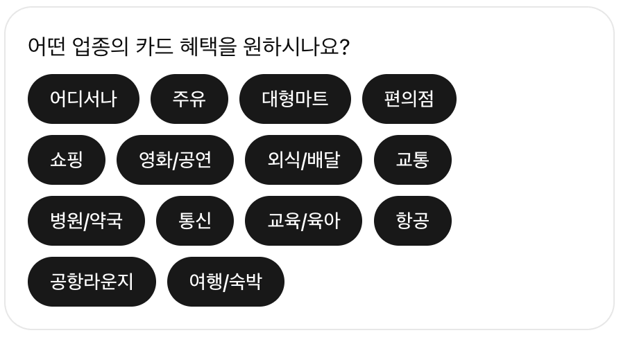
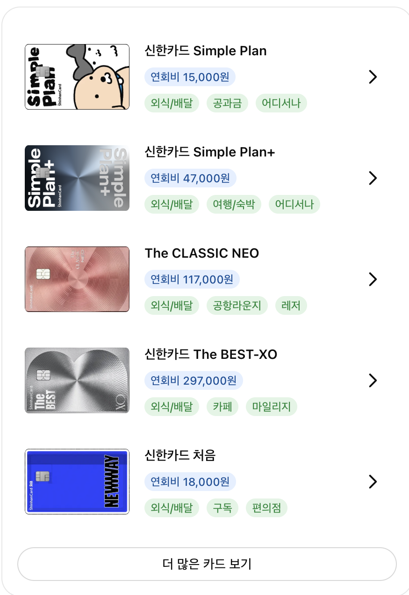

# 신한카드 MCP 외부 플랫폼 연동 가이드 - 간략본

- 문서 버전: 0.9 (협의용)
- 서버명: `shinhan-card-mcp`
- 대상: 신한카드 MCP를 연동하는 외부 AI/대화형 플랫폼

## 1. 문서 범위

본 문서는 **신한카드 MCP 고유 계약만** 설명합니다.

MCP 초기화, 프로토콜 협상, Streamable HTTP, JSON-RPC, `tools/list`, `tools/call`,
ContentBlock, 오류 형식 등 표준 동작은 아래 공식 문서를 따릅니다.

- MCP 공식 사양: https://modelcontextprotocol.io/specification/
- MCP TypeScript SDK: https://github.com/modelcontextprotocol/typescript-sdk
- MCP Python SDK: https://github.com/modelcontextprotocol/python-sdk

외부 플랫폼은 공식 MCP SDK 사용을 권장합니다. Tool 정의는 이 문서에 복사된 내용을
고정하지 말고 신한카드 MCP의 `tools/list` 응답을 최종 기준으로 사용합니다.

## 2. 접속 정보

| 항목 | 운영 환경 |
| --- | --- |
| MCP Endpoint | `<PROD_MCP_ENDPOINT>/mcp` |
| Health Endpoint | `<PROD_BASE_URL>/health` |
| 필수 인증 헤더 | `Infer-Auth-Key: <별도 전달>` |
| 허용 IP 등록 | `<협의>` |

Endpoint와 실제 인증 키는 별도 보안 채널로 전달합니다.

## 3. 업체 식별 및 인증

신한카드는 연동 업체와 환경별로 `Infer-Auth-Key`를 발급합니다. 이 값으로 요청 업체를
식별하고 접근 권한을 확인합니다.

```http
Infer-Auth-Key: <신한카드가 발급한 키>
```

적용 기준:

- `initialize`, `notifications/initialized`, `tools/list`, `tools/call`을 포함한 모든
  `/mcp` HTTP 요청에 반드시 포함합니다.
- `GET /mcp`를 사용하는 경우에도 동일하게 포함합니다.
- MCP SDK의 HTTP Client 또는 transport 기본 헤더에 설정하는 것을 권장합니다.
- 업체 간 키를 공유하면 안 됩니다.
- 키 원문을 애플리케이션 로그, 화면, 이메일 및 오류 응답에 노출하면 안 됩니다.
- 누락, 오입력, 만료, 폐기 또는 환경 불일치 시 요청이 거부될 수 있습니다.

## 4. Tool 제공 원칙 및 호출 예시

제공 Tool의 종류, 이름, 설명 및 입력값은 연동 업체와의 계약에 따라 달라질 수 있습니다.
따라서 이 문서의 예시를 고정 명세로 사용하지 않고, 실제 연동 환경의 `tools/list` 응답을
최종 기준으로 사용합니다.

Tool의 `description`, `inputSchema`, enum 및 annotations는 `tools/list`에서 받은 값을
그대로 LLM에 제공합니다.

### 4.1 Tool 목록 조회 예시

연동 플랫폼은 초기화 완료 후 `tools/list`로 현재 사용 가능한 Tool 정의를 조회합니다.
아래 예시는 전체 목록 중 카드 추천 Tool 한 개만 표시한 것입니다. 실제 응답에 포함되는
Tool의 종류와 개수는 업체별 계약 및 접근 권한에 따라 달라질 수 있습니다.

요청:

```json
{
  "jsonrpc": "2.0",
  "id": 2,
  "method": "tools/list",
  "params": {}
}
```

응답:

```json
{
  "jsonrpc": "2.0",
  "id": 2,
  "result": {
    "tools": [
      {
        "name": "getCreditCardRecommendationsWithSelector",
        "title": "소비 업종별 카드 안내 (선택 위젯)",
        "description": "Recommends Shinhan Card(신한카드) credit cards based on the user's preferred spending category and annual-fee range. MUST be called for ANY card recommendation request, including vague requests. Pass the closest supported category code as industry; omit it when the user does not specify a category. Always set annualFee and use 제한없음 when no range is specified. Set cardType to 2 only for an explicit check-card request. Default sort is 출시일순.",
        "inputSchema": {
          "type": "object",
          "properties": {
            "industry": {
              "type": "integer",
              "format": "int32",
              "description": "혜택을 원하는 업종 번호(1~24). 업종을 명시하지 않은 경우 null로 설정합니다."
            },
            "annualFee": {
              "type": "string",
              "description": "연회비 구간. 허용값: 0~1만원, 1~2만원, 2~3만원, 3~4만원, 4~5만원, 5~10만원, 10만원이상, 제한없음."
            },
            "cardType": {
              "type": "integer",
              "format": "int32",
              "description": "카드 종류. 1은 신용카드, 2는 체크카드입니다."
            },
            "sort": {
              "type": "string",
              "description": "정렬 기준. 허용값: 정확도순, 출시일순, 높은연회비순, 낮은연회비순."
            }
          },
          "required": []
        },
        "outputSchema": {
          "type": "object",
          "properties": {
            "result": {
              "type": "string"
            }
          },
          "required": [
            "result"
          ],
          "x-fastmcp-wrap-result": true
        },
        "annotations": {
          "title": "소비 업종별 카드 안내 (선택 위젯)",
          "readOnlyHint": true,
          "destructiveHint": false,
          "idempotentHint": true,
          "openWorldHint": false
        },
        "_meta": {
          "tool_code": "TL-COMM-004"
        }
      }
    ]
  }
}
```

위 예시는 가독성을 위해 긴 `description`과 일부 입력 설명을 축약했습니다. 실제 연동 시에는
응답받은 `description`, `inputSchema`, `outputSchema`, `annotations`, `_meta`를 임의로
재작성하지 않고 그대로 사용합니다.

### 4.2 Tool 호출 요청 예시

아래는 실제 타업체 연동에서 카드 추천 Tool을 호출한 요청 예시입니다.

```json
{
  "jsonrpc": "2.0",
  "id": 3,
  "method": "tools/call",
  "params": {
    "name": "getCreditCardRecommendationsWithSelector",
    "arguments": {
      "industry": 2,
      "annualFee": "0~1만원대",
      "cardType": 1,
      "sort": "출시일순"
    }
  }
}
```

신규 업체에 실제로 제공할 Tool과 입력 스키마는 계약 확정 후 `tools/list`를 통해
제공합니다.

## 5. 응답 참고 예시 및 협의 원칙

신한카드 MCP의 프로토콜 계층은 MCP 공식 표준을 따릅니다. 실제 전송 시에는 아래 객체를
`CallToolResult.content[0].text`에 JSON 문자열로 직렬화하여 전달합니다. MCP envelope는
`jsonrpc=2.0`, 요청과 동일한 `id`, `result.isError=false`를 포함합니다.

### 5.1 텍스트 응답과 위젯 응답 선택 정책

현재 타업체 연동에서는 Tool별로 위젯 사용 여부를 연동 파트너가 선택할 수 있습니다.
텍스트 응답과 위젯 응답은 처리 방식이 다릅니다.

| 구분 | 처리 방식 |
| --- | --- |
| 위젯 사용 | 제공자가 구성한 위젯을 화면에 그대로 사용하며, LLM이 위젯 내용을 다시 가공하지 않습니다. |
| 위젯 미사용 | Tool의 일반 텍스트 응답을 LLM이 활용하여 대화 맥락에 맞는 최종 답변을 생성합니다. Markdown 사용을 권장합니다. |

위젯 미사용 방식에서는 Tool 호출 중임을 나타내는 화면이 일시적으로 노출될 수 있습니다.
신규 업체 연동 시에도 위젯 지원 여부와 적용 방식을 먼저 협의하고, 위젯을 사용하지 않는
경우에는 `content[0].text`에 LLM이 활용할 일반 텍스트 또는 Markdown을 제공합니다.

텍스트 응답 예시:

```json
{
  "jsonrpc": "2.0",
  "id": 3,
  "result": {
    "content": [
      {
        "type": "text",
        "text": "**카드 안내**\n\n- 업종: **주유**\n- 연회비: **0~1만원대**\n- 추천 카드: `신한카드 Simple Plan`"
      }
    ],
    "isError": false
  }
}
```

### 5.2 위젯 구성 및 전송 규칙

현재 위젯 연동 사례에는 다음 규칙이 적용되어 있습니다.

- 위젯 본문은 OpenAI ChatKit widgets 스펙을 준수합니다.
- ChatKit 위젯 전체 객체를 최상위 `widget` 프로퍼티로 한 번 감싸서 전송합니다. 이
  래퍼는 현재 연동 플랫폼을 위한 추가 계약입니다.
- 제공자는 위젯에 `status` 프로퍼티를 넣지 않습니다. 현재 연동 플랫폼이 로고와 출처
  서비스명을 표시하기 위해 해당 프로퍼티를 사용합니다.
- 위젯 JSON 형식이 잘못되거나 지원 스펙을 위반하면 일반 텍스트 응답으로 처리될 수
  있습니다.
- `copy_text`는 위젯 미지원 환경의 대체 답변이 아니라, 공유 기능에서 사용할 내용을
  담는 프로퍼티입니다.
- `copy_text`는 굵은 글씨, 기울임 글씨, 순서가 없는 목록, 순서가 있는 목록, 인라인 코드
  등 간단한 Markdown으로 작성합니다.
- 현재 연동 플랫폼이 위젯 상단의 로고와 출처 영역을 자동으로 추가하므로 제공자는 해당
  영역을 위젯 본문에 중복 구성하지 않습니다.

위젯 응답은 `content[0].text`에 `widget`과 `copy_text`를 가진 JSON 객체를 문자열로
직렬화하여 전달합니다. 아래의 `...`는 문서 가독성을 위한 축약입니다.

```json
{
  "jsonrpc": "2.0",
  "id": 3,
  "result": {
    "content": [
      {
        "type": "text",
        "text": "{\"widget\":{\"type\":\"Card\",\"children\":[\"...\"]},\"copy_text\":\"**카드 안내**\\n\\n- 업종: **주유**\\n- 추천 카드: `신한카드 Simple Plan`\"}"
      }
    ],
    "isError": false
  }
}
```

### 5.3 위젯 포함 결과 데이터 예시

아래는 위 요청에 대해 실제 타업체 연동에서 사용한 `text` 값을 JSON으로 한 번 더
역직렬화한 결과입니다. 가독성을 위해 pretty print했으며, 반복되는 카드 목록은 첫 번째
항목만 전체 표시하고 나머지 항목은 중략했습니다.

```json
{
  "widget": {
    "type": "Card",
    "children": [
      {
        "type": "Col",
        "gap": 4,
        "padding": {
          "x": 2,
          "y": 3
        },
        "children": [
          {
            "type": "Row",
            "key": "신한카드 Simple Plan",
            "gap": 4,
            "align": "center",
            "padding": {
              "y": 2
            },
            "children": [
              {
                "type": "Image",
                "src": "https://cdn.www.shinhancard.com/pconts/static/images/card/plate/POGDXC_G7_v_f_s.webp",
                "alt": "신한카드 Simple Plan 카드 이미지",
                "width": 112,
                "height": 72,
                "fit": "contain",
                "radius": "sm"
              },
              {
                "type": "Col",
                "gap": 2,
                "flex": "auto",
                "children": [
                  {
                    "type": "Text",
                    "value": "신한카드 Simple Plan",
                    "size": "sm",
                    "weight": "semibold",
                    "maxLines": 2
                  },
                  {
                    "type": "Row",
                    "gap": 2,
                    "children": [
                      {
                        "type": "Badge",
                        "label": "연회비 15,000원",
                        "color": "info",
                        "variant": "soft"
                      }
                    ]
                  },
                  {
                    "type": "Row",
                    "gap": 2,
                    "children": [
                      {
                        "type": "Badge",
                        "label": "주유",
                        "color": "success",
                        "variant": "soft"
                      },
                      {
                        "type": "Badge",
                        "label": "쇼핑",
                        "color": "success",
                        "variant": "soft"
                      },
                      {
                        "type": "Badge",
                        "label": "카페",
                        "color": "success",
                        "variant": "soft"
                      }
                    ]
                  }
                ]
              },
              {
                "type": "Button",
                "label": ">",
                "variant": "ghost",
                "uniform": true,
                "size": "xl",
                "onClickAction": {
                  "payload": {
                    "target": {
                      "type": "sendUserMessage",
                      "properties": {
                        "text": "신한카드 Simple Plan 혜택 알려줘"
                      }
                    }
                  }
                }
              }
            ]
          },
          "... 나머지 카드 항목은 동일 구조로 중략 ..."
        ]
      },
      {
        "type": "Button",
        "label": "더 많은 카드 보기",
        "variant": "outline",
        "pill": true,
        "block": true,
        "onClickAction": {
          "payload": {
            "target": {
              "url": "https://www.shinhancard.com/mob/MOBFM039N/MOBFM039C01.shc?crustMenuId=ms467",
              "pcUrl": "https://www.shinhancard.com/mob/MOBFM039N/MOBFM039C01.shc?crustMenuId=ms467"
            }
          }
        }
      }
    ]
  },
  "copy_text": "**카드 안내**\n\n- 업종: **주유**\n- 연회비: **0~1만원대**\n- 신한카드 Simple Plan (`15,000원`)\n- 나머지 카드 목록 중략\n\n_연회비와 혜택 조건은 카드 상세 페이지에서 최종 확인해 주세요._"
}
```

중략 표시는 문서 가독성을 위한 것으로 실제 응답에는 포함되지 않습니다.

이 요청·응답은 타업체의 표준과 화면 구성 방식에 맞춘 실제 연동 사례이며, 신규
업체의 필수 계약을 의미하지 않습니다. Tool 결과를 담는 MCP 응답 구조는 표준에 맞추되,
`text` 내부 데이터 형식과 위젯·컴포넌트·사용자 액션 규격은 신규 업체가 채택한 표준과
렌더링 환경을 확인한 후 별도로 협의합니다.

연동 착수 시 다음 항목을 양사 협의로 확정합니다.

- 업체가 지원하는 MCP 버전과 SDK 또는 transport
- Tool 결과를 수신할 `CallToolResult` 처리 방식
- 텍스트 및 구조화 데이터 처리 방식
- 위젯 제공 여부와 세부 응답 스키마
- 버튼 클릭, 후속 사용자 발화 및 외부 URL 이동 방식
- 오류, timeout 및 재시도 처리 기준

위젯 응답 예시와 UI·액션 상세 계약은 업체의 표준 명세를 확인한 뒤 별도 협의본으로
제공합니다.

### 5.4 타업체 연동 화면 예시

아래 이미지는 앞의 요청·응답을 화면에 적용한 참고 사례입니다. 화면 디자인과 위젯
구조는 신규 업체의 필수 규격이 아니며, 실제 연동 시 해당 업체의 표준에 맞춰 협의합니다.



### 5.5 카드 추천 결과 화면 예시


